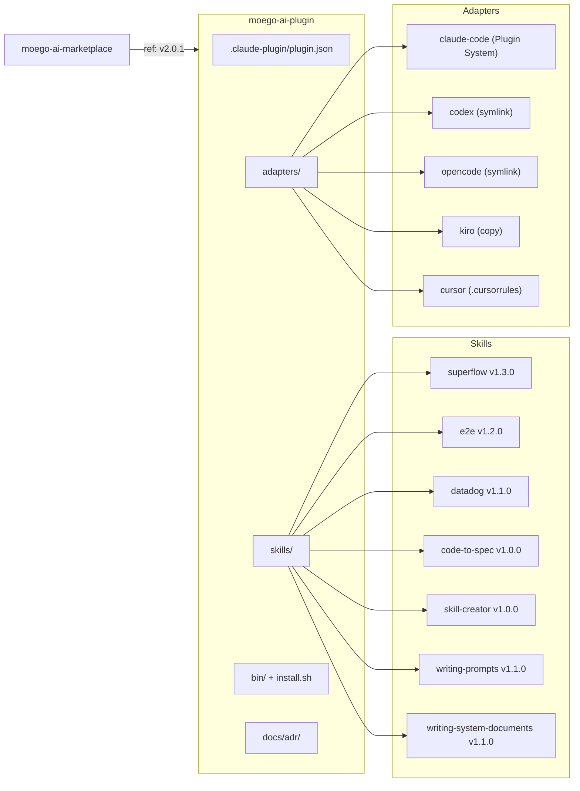

# CLAUDE.md

MoeGo 研发团队 AI Agent Plugin 仓库。为 Claude Code、Codex、OpenCode、Kiro 等 AI 编码代理提供可扩展的 Skills 集合。

## 仓库结构



## 安装与分发

- Marketplace 仓库：`MoeGolibrary/moego-ai-marketplace`（独立仓库，仅存 marketplace.json）
- Plugin 仓库：`MoeGolibrary/moego-ai-plugin`（本仓库）
- 安装命令：`/plugin marketplace add MoeGolibrary/moego-ai-marketplace` → `/plugin install moego@moego-ai-marketplace`
- 非 Claude Code 工具：运行 `install.sh`，通过 symlink/copy 适配

## 版本管理

- `plugin.json` 的 `version` 字段、git tag、marketplace.json 的 `version` + `ref` 三者必须一致
- 发版流程：代码合入 main → bump plugin.json version → 打 tag → 更新 marketplace ref
- 当前版本：2.0.1（tag: v2.0.1）

## Skill 目录

| Skill | 版本 | 用途 | 调用 |
|-------|------|------|------|
| superflow | 1.3.0 | AI Native 全流程开发工作流（需求→规划→实现→测试→交付） | `/moego:superflow` |
| e2e | 1.2.0 | E2E 测试规划与 Playwright 代码生成 | `/moego:e2e` |
| datadog | 1.1.0 | Datadog 日志/Trace/服务依赖查询（需 DD_API_KEY 环境变量） | `/moego:datadog` |
| code-to-spec | 1.0.0 | 模块 SPEC 规格文档逆向编写（4 种模块类型） | `/moego:code-to-spec` |
| skill-creator | 1.0.0 | SKILL.md 编写、审查与改进 | `/moego:skill-creator` |
| writing-prompts | 1.1.0 | 编写一次性 LLM Prompt（9 原则） | `/moego:writing-prompts` |
| writing-system-documents | 1.1.0 | 编写 Agent 常驻系统文档（6 原则） | `/moego:writing-system-documents` |

## Skill 开发规范

### 目录约定

```
skills/<skill-name>/
├── SKILL.md              # Skill 定义（必须）
├── references/           # 参考文档，按需加载（可选）
└── scripts/              # 脚本文件（可选）
```

### 命名规则

- plugin.json `name: "moego"` — 命名空间
- SKILL.md `name` 字段用 bare name（如 `superflow`），不加 `moego-` 前缀
- Claude Code 自动拼接为 `/moego:<skill-name>`
- Codex/OpenCode 通过 adapter symlink 获得 `moego-<skill-name>` 别名

### SKILL.md 写作约束

- `description` 字段强制英文（Agent 据此判断何时加载）
- 不使用 `triggers` 字段（Plugin System 接管）
- frontmatter + 核心指令 ≤ 1,500 词，超出拆到 `references/`
- 脚本路径用 `${CLAUDE_PLUGIN_ROOT}/skills/<skill-name>/scripts/`

### 创建新 Skill 步骤

1. 创建 `skills/<name>/SKILL.md`，frontmatter 含 `name`、`version`、`description`
2. 脚本放 `scripts/`，参考文档放 `references/`
3. 运行 `install.sh` 验证 adapter symlink 正确
4. 提交 PR

## 代码风格

- 文件编码：UTF-8（无 BOM）
- Shell 脚本：`#!/usr/bin/env bash`，`set -e`
- Python 脚本：`uv run` 执行，依赖 `requests`、`python-dateutil`
- 文档语言：中文（SKILL.md description 用英文）

## 提交规范

- 格式：`type(scope): description ENT-0`
- type：`feat` / `fix` / `refactor` / `docs` / `chore`
- scope：skill 名称或模块名（如 `superflow`、`e2e`、`plugin`）
- 分支命名：`feature-xxx` / `bugfix-xxx` / `chore-xxx`
- main 分支有 PR 保护，不可直接 push

## 禁止操作

- 不修改 plugin.json 的 `name` 字段
- 不在 SKILL.md name 字段添加 `moego-` 前缀
- 不在 SKILL.md 添加 `triggers` 字段
- 不删除 `adapters/` 目录（非 Claude Code 工具依赖）
- 不删除 `install.sh`（Plugin System 降级方案）
- 不硬编码凭证或 API Key（使用环境变量）

## 架构决策

- ADR-0001（Accepted）：从手工 symlink 迁移到 Claude Code Plugin System，详见 `docs/adr/0001-moego-plugin-architecture.md`

